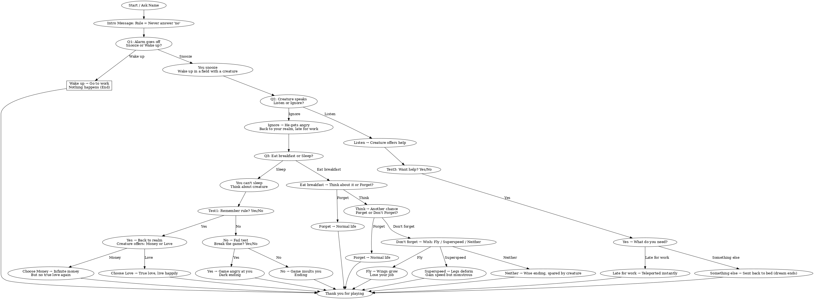

# Life Choice Game

An interactive text-based adventure game written in Python.  
You play as yourself, following a one rule:  
*Never answer with "no".*

Depending on your choices, you’ll experience different story paths and multiple endings — some lighthearted, some dark.

## Features:                                          
* Multiple decision branches and outcomes.
* Choices affect the story in surprising ways.
* Hidden tests to check if you follow the rule.
* Fun, surreal endings

## Run this on:                                                                 
python3 game.py

## Structue:                                                         
life-choice-game/                                                                                                                    
│── game.py                                                  
│── images/                                                                                                                                                          
│   └── life_choice_flowchart_highres.png                                                                                            
└── README.md                

## Installation:                                                                          
Clone the repository

### screenshot of code and game:                                                               

This is a flow chart of my game and every single decision:

